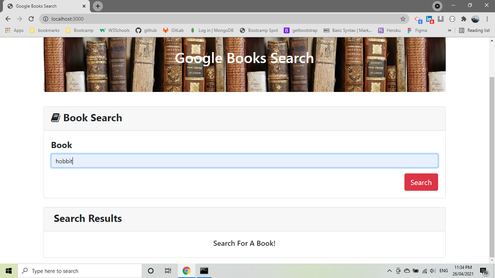
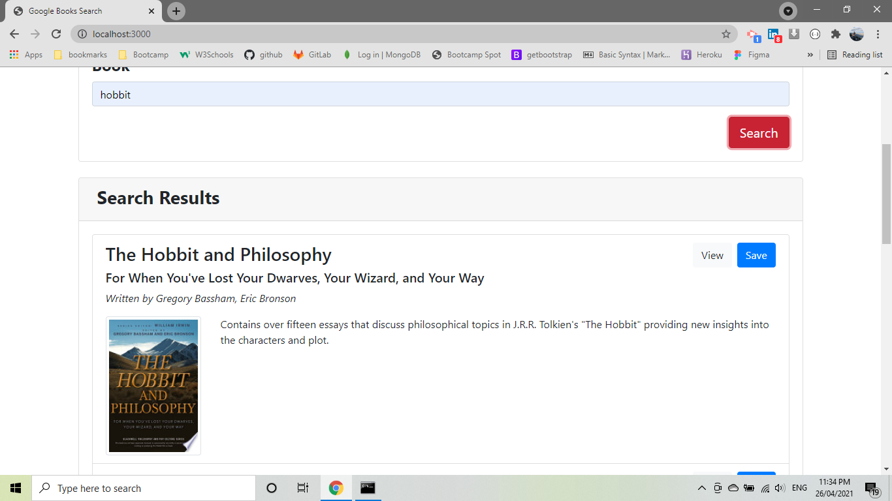
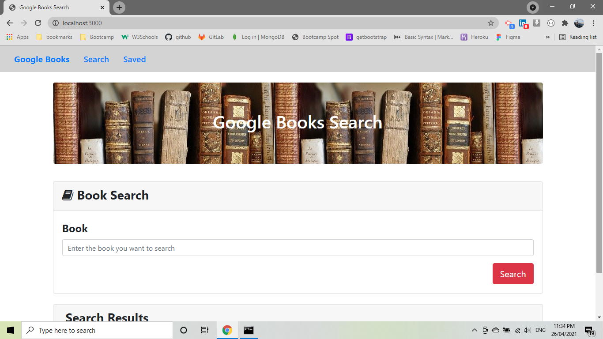
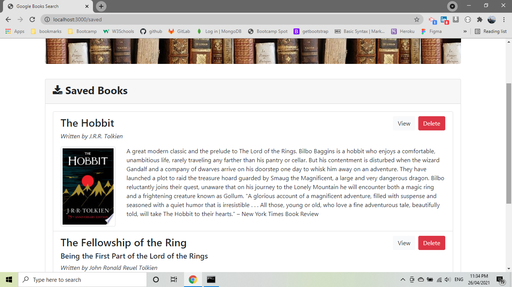

# GoogleBooksSearch

* [links](#links)
* [Description](#description)
* [Built With](#builtwith)
* [Installation](#installation)
* [Screenshots](#screenshots)
* [Questions](#questions)

## links

[Repository link](https://github.com/pfotis/GoogleBooksSearch)

[website link](https://ancient-cove-11223.herokuapp.com/)

## Description

    At this app the use could search for any book he/she like. It is not important the user 
    to know the title of the book but the user could type subject or theme of the books. This 
    is happen with the help from the google API.

## Built With

    React.js
    HTML
    Bootstrap
    CSS
    Javascript

## Installation

    npx create-react-app employee-directory
    npm install axios
    npm install bootstrap-css-only
    npm install --save gh-pages

## Screenshots

    With the following pictures the user could see the outfit of this project.

   

## Questions

    For any questions about this repository, please contact me at pfotis@gmail.com
    View my work in GitHub pfotis(https://github.com/pfotis)